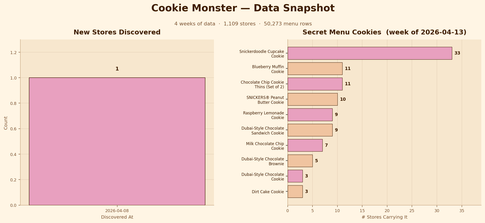

# Cookie Monster

A web scraper that builds a weekly database of Crumbl Cookie flavors by store location.

## Overview

The following project creates a database (.db file) with two tables:
- `stores`: Scrapes the https://crumblcookies.com/order/carry_out page to create a list of all stores along with each store's city and state data, as well as when the store was first detected by the scrape
- `menu_items`: Scrapes each individual store's webpage, https://crumblcookies.com/order/carry_out/41ststreet, and produces a complete list of all cookies available by store for each week the scrape is run

The inspiration for this project was to find out if Crumbl Cookie discontinued their [Almost Everything Bagel Cookie](https://crumblcookies.com/profiles/almost-everything-bagel-sandwich-cookie). I am not a big fan of Crumbl Cookie, but for some reason I enjoyed the Almost Everything Bagel Cookie. This project also provided me with some practice using Claude Code to quickly create and deploy a project. I have some experience with web scraping and estimated this project would have taken me a day to code. With Claude Code, the project was up and running within an hour. I made a couple of changes here and there had a in-depth prompt, but the majority of the code was AI generated and I take no credit for it.

## Setup

```bash
pip install -r requirements.txt
playwright install chromium # will need to have https://playwright.dev
```

## Usage

```bash
python discover.py       # Capture raw API responses
python main.py --limit 5 # Test run with 5 stores
python main.py           # Full weekly scrape. Note the process runs 4 slugs at a time to avoid rate limits
```

### Folder Structure

```bash
├── cookie_monster.db
├── data
│   └── discovery
│       └── tx114th_menu_raw.json
├── db
│   ├── __init__.py
│   ├── __pycache__
│   │   └── __init__.cpython-313.pyc
│   └── schema.sql
├── explore.ipynb
├── main.py
├── README.md
├── requirements.txt
└── scraper
    ├── __init__.py
    ├── __pycache__
    │   ├── __init__.cpython-313.pyc
    │   ├── browser.cpython-313.pyc
    │   ├── locations.cpython-313.pyc
    │   └── menu.cpython-313.pyc
    ├── browser.py
    ├── locations.py
    └── menu.py
```

## Final Thoughts

Again, the goal of the project was to find the Almost Everything Bagel Cookie, which is still around and has appeared sporadically over the weeks — unfortunately, only in Florida and Texas. Nonetheless, this is a fun project that provides good practice, and allows us to collect rich data on a fast-growing company with a unique business model. Here is an example of another use case for the data.


